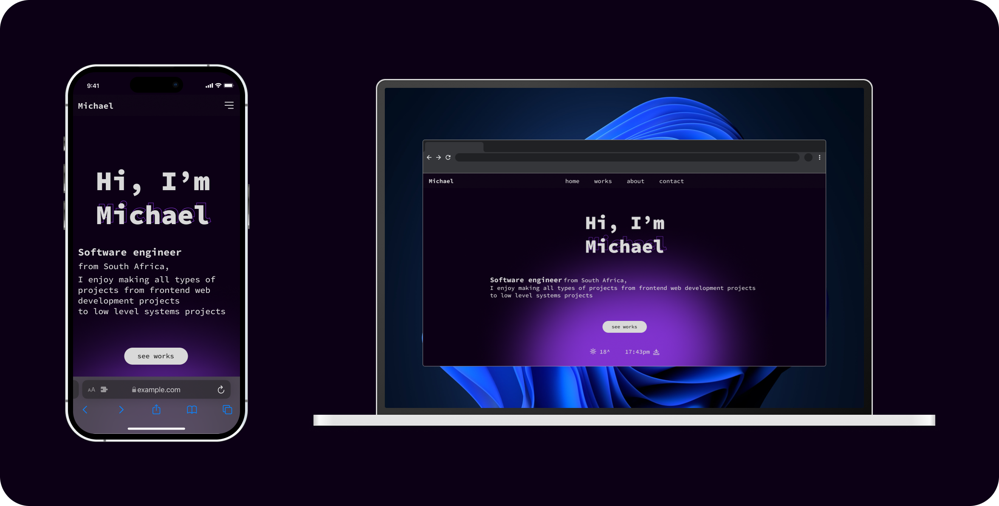

# portfolio-src-files
Source Files for @ https://waveyboym.github.io/

# Presentation

# TL;DR
You can fork this repo and modify the src code if you want to and distribute it. Just please be sure to give proper credit by linking back to this repo as original src. Thanks!

# How to use the src code
1. Download nodejs onto your computer if you don't have it from here (else skip this step): https://nodejs.org/en/download/
2. Download the files in the directory **<a href="https://github.com/waveyboym/portfolio-src-files/tree/main/portfolio-src-code" target="_blank" title="portfolio-src-code">portfolio-src-code</a>** of this repo and place these files in a folder of your naming.
3. Open a terminal to the folder where the files you downloaded from **<a href="https://github.com/waveyboym/portfolio-src-files/tree/main/portfolio-src-code" target="_blank" title="portfolio-src-code">portfolio-src-code</a>** of this repo are.
4. Run `npm install`. If you don't have  **<a href="https://nodejs.org/en/download/" target="_blank" title="nodejs">nodejs</a>** installed, this command wont work.
5. Get an api key from https://www.weatherapi.com/ and place the key in the ".env" file in the root directory of the folder or if you don't want to use this api, you may disable it by navigating to: **<a href="https://github.com/waveyboym/portfolio-src-files/blob/main/portfolio-src-code/disableAPI.txt" target="_blank" title="disable api">disable api</a>** and following the instructions to disable it.
6. After that is done navigate to: **<a href="https://github.com/waveyboym/portfolio-src-files/blob/main/portfolio-src-code/src/sections/Landing.tsx" target="_blank">"src/sections/Landing.tsx"</a>** and on line 82 replace `<Your location here>` with the location you want to query.
7. (Optional)To change the loader's load time go to: **<a href="https://github.com/waveyboym/portfolio-src-files/blob/main/portfolio-src-code/changeLoaderTime.txt" target="_blank" title="change loader time">change loader time</a>** and follow the instructions there.
8. Once that is done and all the appropriate modules have been installed, you may run `npm run dev` in your terminal to launch the website on localhost
9. You may run `npm run build` to build the website and the build files will be found in the "dist" folder.
10. You can make changes to any and all of the files.

# Hosting
...

# Languages and frameworks used
1. **<a href="https://vitejs.dev/" target="_blank" title="Vite">Vite</a>**
2. **<a href="https://reactjs.org" target="_blank" title="reactjs">Reactjs</a>** with **<a href="https://www.typescriptlang.org/" target="_blank" title="typescript">Typescript</a>**
3. **<a href="https://tailwindcss.com" target="_blank" title="Vite">tailwindcss</a>**

# Icons and assets sources:
1. Icons pack: https://www.figma.com/community/file/1177180791780461401
2. Technologies and frameworks: https://www.figma.com/community/file/1130969934918175259
3. Vector graphics: https://www.figma.com/community/plugin/967114006118823084

**Weather forecast is powered by&nbsp;<a href="https://www.weatherapi.com/" target="_blank" title="Free Weather API">WeatherAPI.com</a>**
